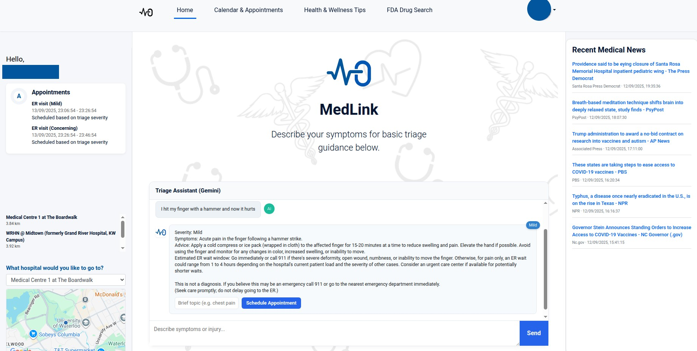
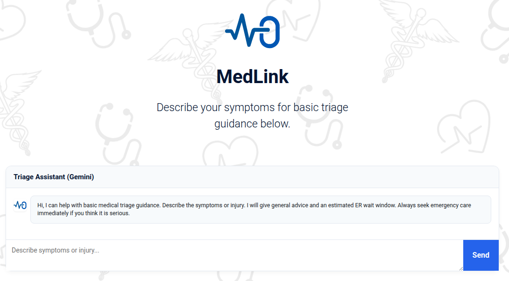
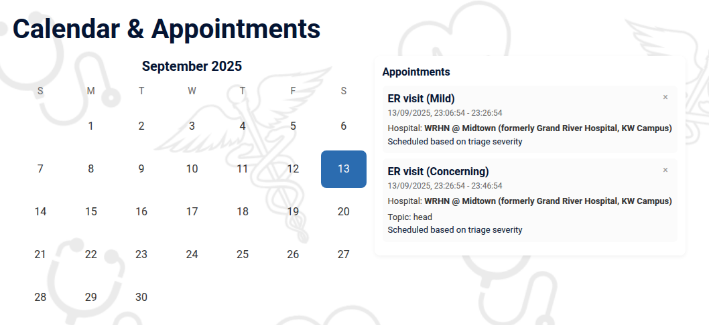
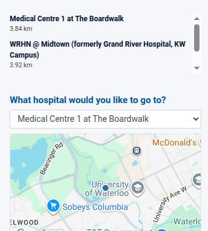
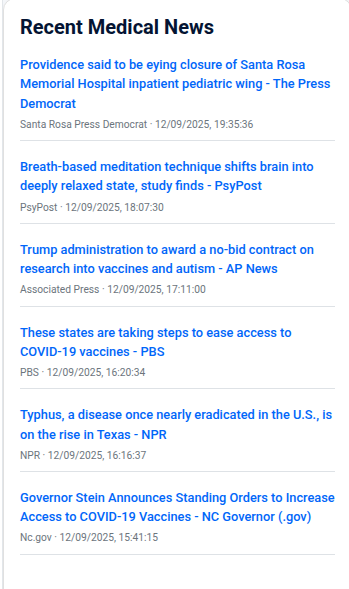

  # MedLink

  MedLink is a patient-first web app designed to reduce long emergency-room wait times and help people access timely care in Canada where many patients lack a family doctor. It pairs an AI-powered triage assistant with location-aware hospital lookup and a lightweight appointment scheduler that prioritizes patients based on severity and wait time.

  

  ---

  ## Why this matters (context)
  Canada faces a shortage of family physicians in many regions and long waits for emergency care with an 8 hour average wait time being the regular. MedLink is designed to:
  - Reduce unnecessary ED visits by providing triage guidance and alternatives when safe to do so.
  - Prioritize serious cases for faster appointments via the weighted scheduler.
  - Help patients make informed decisions using location-aware data, news, and drug references.

  ---

  ## Quick elevator

  MedLink helps users assess symptoms, find the nearest emergency rooms, consume trustworthy medical news and health guidance, and schedule prioritized appointments through an AI-guided flow reducing unnecessary ED visits and helping patients get care faster.

  ## Key features

  - AI Triage Assistant
    - A conversational assistant that collects symptoms, suggests probable causes, gives practical do/don't advice, and when appropriate offers to schedule an appointment on the user's behalf.
    - The assistant reasons about urgency and returns a severity level that the scheduler uses to prioritize bookings.
  

  - Severity-weighted Appointment Scheduling
    - Appointments are queued using a weighted algorithm that balances:
      - Severity level (Critical, High, Medium, Low)
      - Time already waited
    - Severity levels (examples):
      - <span style="color:#c53030;font-weight:bold;">Critical</span>: needs immediate attention (push to front)
      - <span style="color:#dd6b20;font-weight:bold;">Concerning</span>: urgent but not immediately life-threatening
      - <span style="color:#3182ce;font-weight:bold;">Mild</span> and <span style="color:#d69e2e;font-weight:bold;">Moderate</span>: requires timely care within hours/days
      - <span style="color:#2f855a;font-weight:bold;">Minimal</span>: routine, non-urgent
    - The scheduler can shift and reorder future appointments to reflect newly inserted higher-severity bookings.
  

  - Location Services & Nearby Emergency Rooms
    - Uses geolocation (with explicit user permission) to find and rank nearby emergency departments and hospitals.
    - Displays distance, estimated travel time, and hospital details so patients can choose an appropriate location.  
  

  - Up-to-date Medical News & Evidence
    - Aggregates trusted sources for medical news and health guidance (WHO, public health agencies, selected outlets).
    - Provides curated health and wellness content and links to primary sources.  
  

  - FDA Drug Lookup (reference)
    - Lookup for drug information and safety notices (sourced from public APIs where available).
    - Useful for patients checking interactions, warnings, or recall notices.


  - Persistent Appointments & Local Storage
    - Appointments are stored locally and persist across sessions.
    - The app avoids seeding demo appointments in production; only user-scheduled items are persisted.

  ## Technology stack
  - Frontend: React, Context API, React Router, Reactstrap/Bootstrap, custom CSS
  - Backend: Node.js + Express (lightweight API endpoints used for news, triage simulation, calendar integration, authentification services, and LLM automation)
  - Testing: Jest + React Testing Library

  ## Running locally
  1. Clone the repo
  ```bash
  git clone <repo-url>
  cd MedLink
  ```
  2. Set-up API Keys
  - Create a .env file to store your API keys
  - Google maps and Gemini API keys can be obtain from your GoogleCLoud account
  - News API key found @ https://newsapi.org/s/us-health-news-api
  - FDA drug search API key found @ https://open.fda.gov/apis/
  ```bash
  REACT_APP_GOOGLE_MAPS_API_KEY=google_maps_key
  GEMINI_API_KEY=gemini_key
  ALLOW_UNAUTH_TRIAGE=true
  API_PORT=3001
  MEDICAL_NEWS_API_KEY=news_api_key
  DRUG_SEARCH_API_KEY=fda_api_key
  ```
  3. Install dependencies
  ```bash
  npm install
  ```
  4. Start the backend API (if using local endpoints)
  ```bash
  node api-server.js
  ```
  5. Start the frontend
  ```bash
  npm start
  ```
  6. Open the app in your browser at http://localhost:3000

  ## Privacy & permissions
  - Location services are required and used only with explicit user consent and to find nearby EDs/hospitals.
  - The app stores appointments locally for sercurity purposes.

  ## License & credits
  MIT License — credit to the project authors and contributors.
